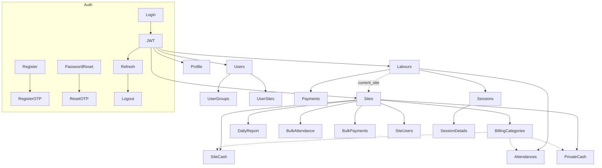
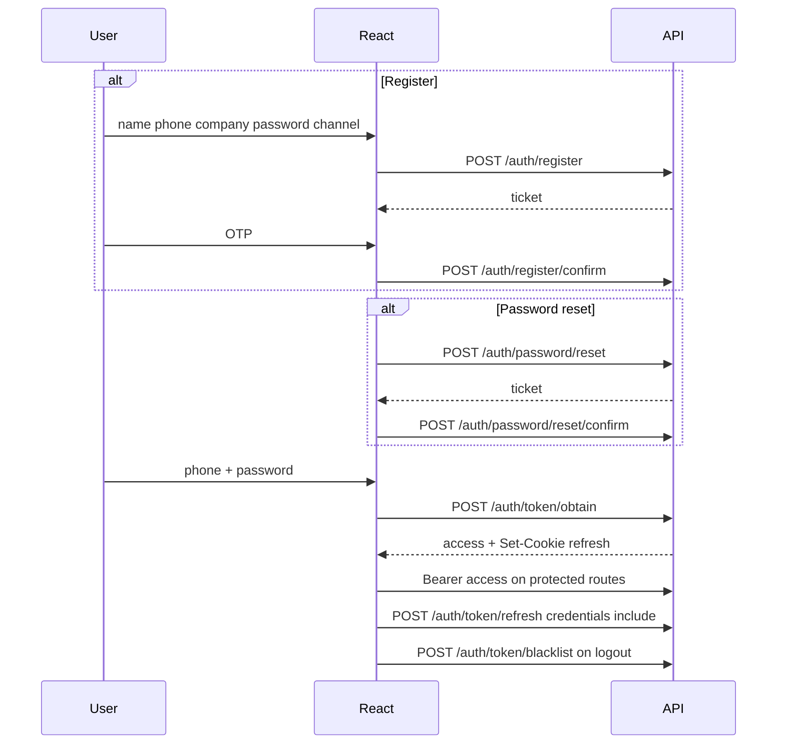

# SiteMan API — Full Frontend Plan

Source: [openapi.yaml](f:/SiteMan/siteman-client/openapi.yaml) (OpenAPI 3.0.3, **SiteMan API** `1.0.0 (v1)`).


| Metric        | Value                                          |
| ------------- | ---------------------------------------------- |
| Paths         | 40                                             |
| Operations    | **71**                                         |
| Tags          | `auth`, `profile`, `users`, `labours`, `sites` |
| Pagination    | None (lists return bare arrays)                |
| Subscriptions | **No CRUD endpoints** — still handle write errors `subscription_expired`, `subscription_limit_exceeded` |
| Trailing slash | **None** — `/api/v1/users` not `/users/` |
| Updates | Prefer **PATCH**; expect **405** on PUT/DELETE where disabled |


---

## Scope

**In scope:** every path under `/api/v1` in the OpenAPI file.

**Out of scope (not exposed):**

- Subscription / company / invitation CRUD (not exposed). Still surface subscription write failures in UI.
- Site close / reopen (mentioned in site descriptions; no endpoints; handled elsewhere)
- Company resource CRUD (company exists only as tenant field / register `company_name`)

---

## 1. Feature modules


| Module              | Tag       | Responsibility                                                                                                     |
| ------------------- | --------- | ------------------------------------------------------------------------------------------------------------------ |
| **Auth**            | `auth`    | Register + OTP, password reset + OTP, login / refresh / logout, password change                                    |
| **Profile**         | `profile` | Current user GET/PATCH (`/profile`)                                                                                |
| **Users & RBAC**    | `users`   | Company users, group assignment, user↔site assignment                                                              |
| **Sites & ledgers** | `sites`   | Sites, billing categories, daily report, cash, private cash, bulk labour attendance/payments, site↔user assignment |
| **Labours**         | `labours` | Labours, nested attendances/payments, work sessions + details + running session                                    |





---

## 2. Resource relationships


| Resource                | Links                                                                                      | Rules                                                                                                                               |
| ----------------------- | ------------------------------------------------------------------------------------------ | ----------------------------------------------------------------------------------------------------------------------------------- |
| **Company**             | Implicit tenant on most entities                                                           | Created at register; no company API                                                                                                 |
| **User**                | Has groups; assigned to sites                                                              | No user DELETE; create uses random password (per API docs)                                                                          |
| **UserProfile**         | Self via `/profile`                                                                        | Writable: `name`, `email`, `phone_number`. Password via auth endpoints. Returns `groups`, `permissions`, `sites`, `is_companyadmin` |
| **Site**                | Nested: billing-categories, cash, private-cash, labour-attendances, labour-payments, users | `is_closed` / `closed_at` read-only                                                                                                 |
| **BillingCategory**     | Optional FK `billing` on attendance / site cash / private cash                             | Fields: `name`, `display_order`, `is_active`, `is_done` (`is_done` deactivates)                                                     |
| **Labour**              | `current_site` (one site); nested attendances, payments, sessions                          | Soft-deactivate via `is_active` (no DELETE)                                                                                         |
| **Attendance**          | labour × site × date                                                                       | `present` ∈ `0`…`3`; `is_sealed` locks edits                                                                                        |
| **LabourPayment**       | labour × site × date                                                                       | `type`: payment, return                                                                                                             |
| **LabourSession**       | Seals open period after `last_session_date`                                                | POST empty/no useful body; DELETE only latest if snapshot matches                                                                   |
| **LabourSessionDetail** | Per-site breakdown under session                                                           | Read-only                                                                                                                           |
| **SiteCash**            | Site ledger                                                                                | `type`: deposit, withdraw, cost                                                                                                     |
| **PrivateSiteCash**     | Site private ledger                                                                        | `type`: bill, cost                                                                                                                  |
| **SiteUser / UserSite** | Same assignment, two directions                                                            | Assign by `{"user": id}` or `{"site": id}`                                                                                          |


**Attendance / payment write paths**

- Site day entry: bulk `POST` arrays on `/sites/{site_pk}/labour-attendances` and `.../labour-payments` (each item includes `labour`).
- Labour corrections: full CRUD under `/labours/{labour_pk}/attendances|payments`.

---

## 3. Authentication and authorization

### Auth flows




| Decision | Choice |
| --- | --- |
| Access token | React memory/state only; `Authorization: Bearer` |
| Refresh token | Prefer httponly `refresh_token` cookie; body also returns `refresh` — do not persist refresh in localStorage |
| Login identity | `phone_number` + `password` |
| Token obtain / refresh response | `{ access, refresh }` + Set-Cookie |
| OTP start response | `{ ticket, otp_expires_in, resend_cooldown }` |
| OTP confirm | `{ ticket, otp }` (reset also needs `new_password`) |
| Password change | `{ current_password, new_password }` → **replace** stored access (+ cookie); all old refresh blacklisted |
| Access lifetime | ~10 minutes — queue requests + silent refresh on 401; optional proactive refresh |
| Throttle | Handle **429** (login ~3/min; register/reset ~20/h) |
| Password reset UX | Always show “enter OTP” path — API may return **ghost tickets** for unknown/inactive phones (anti-enumeration) |


### Public vs protected


| Public                                                                   | Protected (jwtAuth)                                |
| ------------------------------------------------------------------------ | -------------------------------------------------- |
| register*, password/reset*, token/obtain, token/refresh, token/blacklist | password/change, profile, users*, labours*, sites* |


### Authorization (from API + profile)

- Most writes need Django model permissions (`app_label.codename` in `profile.permissions`).
- Assignable groups (exact names): **`Company Admin`**, **`Site Manager`**, **`Site Auditor`**.
  - POST `/users/{id}/groups` body: `{ "id": <group_pk> }`
  - No public “list all groups” catalog endpoint — hardcode these three role options in `UserGroupPicker` (IDs from seeded DB / first assign response / admin knowledge).
- `is_companyadmin`: bypasses **site-assignment** checks only — **does not** bypass model permissions or subscription write checks.
- After login: always `GET /profile`.
- **UI soft-gate** with `permissions` (+ `is_companyadmin` only for company-wide site listing).
- **Hard-stop** on 403 / business 400 codes.
- **Site selector source of truth:**
  - Normal user → `profile.sites`
  - `is_companyadmin` → `GET /sites` (profile.sites is assignments only and may be incomplete)
- Confirmed profile shape (use this; OpenAPI `string` types are wrong):

```json
{
  "id": 1,
  "name": "...",
  "phone_number": "+8801...",
  "email": "...",
  "company": { "id": 1, "name": "..." },
  "is_active": true,
  "is_staff": false,
  "is_companyadmin": true,
  "groups": [{ "id": 1, "name": "Company Admin" }],
  "permissions": ["sites.view_site", "labours.add_labour", "..."],
  "sites": [{ "id": 1, "name": "...", "is_active": true, "is_closed": false }]
}
```

---

## 4. Pages (all exposed APIs)

### Public / auth


| Page            | Route                     | APIs                                                              |
| --------------- | ------------------------- | ----------------------------------------------------------------- |
| Login           | `/login`                  | `POST /auth/token/obtain`                                         |
| Register        | `/register`               | `POST /auth/register`                                             |
| Register OTP    | `/register/confirm`       | `POST /auth/register/confirm`, `/register/resend-otp`             |
| Forgot password | `/password/reset`         | `POST /auth/password/reset`                                       |
| Reset confirm   | `/password/reset/confirm` | `POST /auth/password/reset/confirm`, `/password/reset/resend-otp` |


### App — general


| Page            | Route               | APIs                                                                                   |
| --------------- | ------------------- | -------------------------------------------------------------------------------------- |
| Home            | `/`                 | Placeholder or summary from sites/labours lists                                        |
| Profile         | `/profile`          | `GET/PATCH /profile`; link to password change; logout via `POST /auth/token/blacklist` |
| Change password | `/profile/password` | `POST /auth/password/change`; on success **replace access token state** and rely on new refresh cookie |


### Users (company admin)


| Page        | Route               | APIs                                                         |
| ----------- | ------------------- | ------------------------------------------------------------ |
| Users list  | `/users`            | `GET/POST /users` (`search`, `is_active`, `is_companyadmin`) |
| User detail | `/users/:id`        | `GET/PATCH /users/{id}`                                      |
| User groups | `/users/:id/groups` | `GET/POST /users/{user_pk}/groups`; `DELETE .../groups/{id}` |
| User sites  | `/users/:id/sites`  | `GET/POST /users/{user_pk}/sites`; `DELETE .../sites/{id}`   |


### Sites


| Page                | Route                           | APIs                                                       |
| ------------------- | ------------------------------- | ---------------------------------------------------------- |
| Sites list          | `/sites`                        | `GET/POST /sites` (`is_active`, `is_closed`)               |
| Site detail         | `/sites/:id`                    | `GET/PATCH/DELETE /sites/{id}`; show `is_closed` RO        |
| Site billing        | `/sites/:id/billing`            | billing-categories list/create/retrieve/patch/delete       |
| Site daily report   | `/sites/:id/daily-report?date=` | `GET /sites/{id}/daily-reports?date=`                      |
| Daily labour ledger | `/sites/:id/daily-ledger?date=` | labour-attendances + labour-payments list + bulk create    |
| Site cash           | `/sites/:id/cash`               | cash CRUD                                                  |
| Private cash        | `/sites/:id/private-cash`       | private-cash CRUD                                          |
| Site users          | `/sites/:id/users`              | `GET/POST /sites/{site_pk}/users`; `DELETE .../users/{id}` |


### Labours


| Page               | Route                                           | APIs                                                                         |
| ------------------ | ----------------------------------------------- | ---------------------------------------------------------------------------- |
| Labours list       | `/labours`                                      | `GET/POST /labours` (`current_site`, `is_active`, `search`)                  |
| Labour detail      | `/labours/:id`                                  | `GET/PATCH /labours/{id}`; show running session summary                      |
| Labour attendances | section on detail or `/labours/:id/attendances` | nested attendance CRUD                                                       |
| Labour payments    | section on detail or `/labours/:id/payments`    | nested payment CRUD                                                          |
| Labour sessions    | `/labours/:id/sessions`                         | sessions list                                                                |
| Running session    | `/labours/:id/sessions/running`                 | `GET .../running_session`; seal via `POST .../sessions`; show unsealed rows  |
| Session detail     | `/labours/:id/sessions/:sessionId`              | session retrieve + details list/retrieve; sealed period attendances/payments |


---

## 5. Layouts and shared components

### Layouts


| Layout               | Structure                                                                               | Used by                                        |
| -------------------- | --------------------------------------------------------------------------------------- | ---------------------------------------------- |
| **AuthLayout**       | Branding header; centered form; footer. No bottom nav.                                  | Login, register, OTP, password reset           |
| **AppLayout**        | Branding header + bottom/side nav (Sites, Labours, Users if permitted, Profile).        | All authenticated pages                        |
| **SiteScopedLayout** | Extends AppLayout. Secondary bar: date selector + site selector.                        | Daily report, daily ledger, cash, private cash |
| **Labour detail**    | Extends AppLayout. Page-local tabs/sections: Overview, Attendances, Payments, Sessions. | `/labours/:id/`*                               |


### Shared components


| Component                               | Use                                                                    |
| --------------------------------------- | ---------------------------------------------------------------------- |
| `DateSelector`                          | No future dates are allowed to pick.                                   |
| `SiteSelector`                          | SiteScopedLayout; SiteSelector data from `profile.sites`.active sites  |
| `DataTable` + loading/empty/error       | All lists                                                              |
| `MoneyAmount`                           | Integer amounts                                                        |
| `PresentSelect`                         | Attendance present enum                                                |
| `EnumSelect`                            | Payment/cash type & category enums                                     |
| `BillingCategorySelect`                 | Optional `billing` FK                                                  |
| `SealedBadge`                           | Lock edit/delete when `is_sealed`                                      |
| `BulkDayGrid`                           | Daily labour ledger → dual bulk POSTs                                  |
| `LedgerTable` / `LedgerForm`            | Site cash + private cash                                               |
| `SessionSummaryCard`                    | Session aggregates                                                     |
| `UserGroupPicker`                       | Assign groups by id                                                    |
| `SiteAssignPicker` / `UserAssignPicker` | Bidirectional site↔user assignment                                     |
| `OtpForm` + ticket storage              | Register + password reset                                              |
| `ConfirmDialog`                         | Destructive / seal actions                                             |
| `ApiErrorAlert` | Map `errors[].code` → user copy (`subscription_expired`, `subscription_limit_exceeded`, `site_closed`, `record_sealed`, `already_registered`, …) |
| `AuthProvider` + API client | Bearer, cookie credentials, request queue, 401→refresh once, 429 backoff, password-change token replace |
| `PermissionGate` | Gate on `profile.permissions` codenames; use `is_companyadmin` only for company-wide site scope; do **not** gate solely on group names |
| `SubscriptionBanner` | Read-only / create-blocked messaging from subscription error codes (no plan API) |
| `ClosedSiteBanner` / `SealedBadge` | Block edits when site closed or row sealed |


---

## 6. Contract notes (OpenAPI vs live API)

### Treat as confirmed (type FE from this, not OpenAPI strings)

| Topic | Live contract |
| --- | --- |
| Token obtain/refresh | Body `{ access, refresh }` + httponly cookie `refresh_token` (path under `/api/v1/auth/token`) |
| Register / password-reset start | `{ ticket, otp_expires_in, resend_cooldown }` |
| Profile nested fields | `company` object; `groups[{id,name}]`; `permissions: string[]`; `sites[{id,name,is_active,is_closed}]` |
| Session seal | `POST .../sessions` with empty/`{}` body |
| Role group names | `Company Admin`, `Site Manager`, `Site Auditor` |

### Still verify / watch

| Gap | What to do |
| --- | --- |
| `GET .../daily-reports` OpenAPI typing wrong / `date` param poorly documented | Always send `?date=YYYY-MM-DD`; shape is report aggregates, not `Site` |
| `User.is_active` OpenAPI readOnly vs docs | Test PATCH; if accepted, use for deactivate UX |
| `LabourSessionDetail.payment_details` untyped | Inspect one live object and type locally |
| No list pagination | Client tables; virtualize later |
| OpenAPI may advertise PUT | Expect 405; FE uses PATCH only |
| Fixture/group permissions may be incomplete vs full API surface | Always trust `profile.permissions` at runtime |

---

## 7. Suggested build order

1. API client conventions + AuthProvider (obtain / cookie refresh / blacklist / 401 queue)
2. Login + Register OTP + Password reset OTP (ticket + cooldown + 429)
3. `GET /profile` bootstrap + AppLayout + `PermissionGate` (permissions-based)
4. Profile PATCH + password change (token rotate) + logout
5. Sites list/detail + closed-site read-only UX
6. Users list/create/detail + groups + user↔site assignment (**before** heavy labour writes)
7. Site users assignment (bidirectional parity)
8. Billing categories
9. SiteScopedLayout + Daily labour ledger (bulk array POST)
10. Site cash + private cash
11. Labours list/detail + nested attendance/payment CRUD + assign `current_site`
12. Sessions: running → seal confirm → history → details
13. Daily report (`?date=`) + private-field gating
14. Subscription/limit/sealed/closed error UX polish (`SubscriptionBanner`, code→copy map)
15. Home dashboard (optional aggregates from existing list APIs)


## 7b. Business error → UI map

Handle `drf_standardized_errors` shape: `{ type, errors: [{ code, detail, attr }] }`.

| Code | UI behavior |
| --- | --- |
| `subscription_expired` | Global read-only banner; disable creates/edits |
| `subscription_limit_exceeded` | Block specific create (site/user/labour) with limit message |
| `site_closed` | Site-scoped read-only |
| `record_sealed` | Disable edit/delete on that attendance/payment; explain sealed by session |
| `already_registered` | Register form field error |
| 403 | Hide action if possible; show “no permission” |
| 429 | Auth forms: wait/retry messaging |

No subscription detail endpoint exists — do **not** build a Billing settings page against this API.

---

## 8. Endpoint index (all 71)

### Auth (10)

```
POST /api/v1/auth/register
POST /api/v1/auth/register/confirm
POST /api/v1/auth/register/resend-otp
POST /api/v1/auth/password/reset
POST /api/v1/auth/password/reset/confirm
POST /api/v1/auth/password/reset/resend-otp
POST /api/v1/auth/password/change          # JWT
POST /api/v1/auth/token/obtain
POST /api/v1/auth/token/refresh
POST /api/v1/auth/token/blacklist
```

### Profile (2)

```
GET|PATCH /api/v1/profile                  # JWT
```

### Users (10)

```
GET|POST          /api/v1/users
GET|PATCH         /api/v1/users/{id}
GET|POST          /api/v1/users/{user_pk}/groups
DELETE            /api/v1/users/{user_pk}/groups/{id}
GET|POST          /api/v1/users/{user_pk}/sites
DELETE            /api/v1/users/{user_pk}/sites/{id}
```

### Labours (21)

```
GET|POST          /api/v1/labours
GET|PATCH         /api/v1/labours/{id}
GET|POST          /api/v1/labours/{labour_pk}/attendances
GET|PATCH|DELETE  /api/v1/labours/{labour_pk}/attendances/{id}
GET|POST          /api/v1/labours/{labour_pk}/payments
GET|PATCH|DELETE  /api/v1/labours/{labour_pk}/payments/{id}
GET|POST          /api/v1/labours/{labour_pk}/sessions
GET|DELETE        /api/v1/labours/{labour_pk}/sessions/{id}
GET               /api/v1/labours/{labour_pk}/sessions/running_session
GET               /api/v1/labours/{labour_pk}/sessions/{session_pk}/details
GET               /api/v1/labours/{labour_pk}/sessions/{session_pk}/details/{id}
```

### Sites (28)

```
GET|POST          /api/v1/sites
GET|PATCH|DELETE  /api/v1/sites/{id}
GET               /api/v1/sites/{id}/daily-reports
GET|POST          /api/v1/sites/{site_pk}/billing-categories
GET|PATCH|DELETE  /api/v1/sites/{site_pk}/billing-categories/{id}
GET|POST          /api/v1/sites/{site_pk}/cash
GET|PATCH|DELETE  /api/v1/sites/{site_pk}/cash/{id}
GET|POST          /api/v1/sites/{site_pk}/labour-attendances
GET|POST          /api/v1/sites/{site_pk}/labour-payments
GET|POST          /api/v1/sites/{site_pk}/private-cash
GET|PATCH|DELETE  /api/v1/sites/{site_pk}/private-cash/{id}
GET|POST          /api/v1/sites/{site_pk}/users
DELETE            /api/v1/sites/{site_pk}/users/{id}
```

# Tech Stack

- Vite + React (Javascript, not typescript)
- Tailwind CSS + DaisyUI
- React Router
- TanStack Query
- Axios (cookie credentials)
- React Hook Form + Zod
- Lucide React
- Other necessary packages.